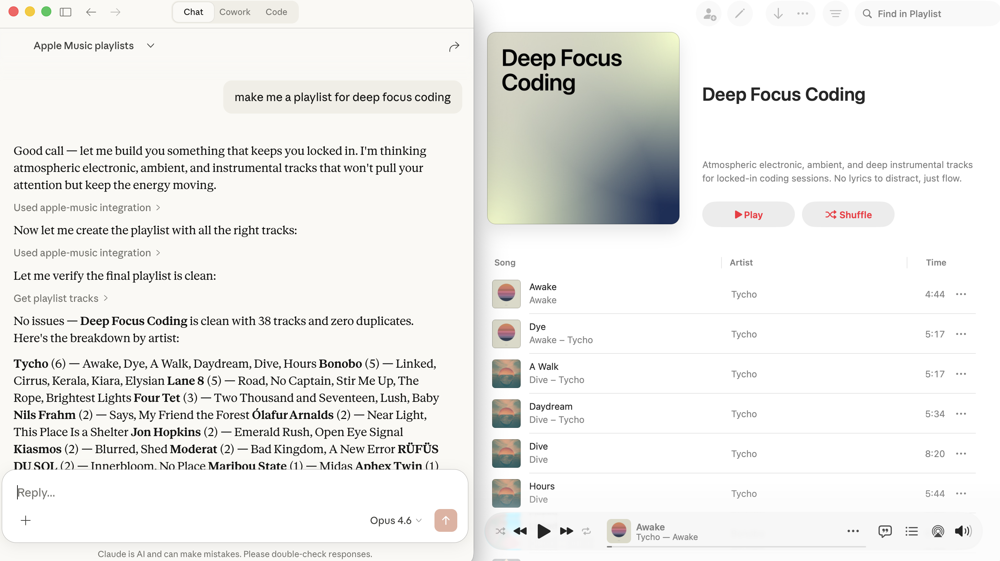

# Apple Music MCP Server

An MCP (Model Context Protocol) server that integrates with Apple Music, allowing Claude and other MCP clients to search the catalog, manage playlists, and access your library.



## Features

- **Search** the Apple Music catalog (songs, albums, artists, playlists)
- **List** your playlists and browse their tracks
- **Create** new playlists with optional initial tracks
- **Add tracks** to existing playlists
- **Browse** your library songs
- **View** recently played tracks
- **Get** personalized recommendations

## Prerequisites

- Node.js 18+
- An [Apple Developer Program](https://developer.apple.com/programs/) membership
- A MusicKit identifier and private key

## Apple Developer Setup

### 1. Create a MusicKit Identifier

1. Go to [Apple Developer > Certificates, Identifiers & Profiles](https://developer.apple.com/account/resources/identifiers/list)
2. Click **+** to register a new identifier
3. Select **MusicKit IDs** (or **Media IDs**)
4. Enter a description (e.g., "MCP Server") and an identifier (e.g., `com.yourname.musicmcp`)
5. Click **Continue** and **Register**

### 2. Create a MusicKit Private Key

1. Go to [Apple Developer > Keys](https://developer.apple.com/account/resources/authkeys/list)
2. Click **+** to create a new key
3. Name it (e.g., "MusicKit MCP Key")
4. Check **MusicKit** and configure it with your MusicKit identifier
5. Click **Continue** and **Register**
6. **Download the .p8 file** (you can only download it once!)
7. Note the **Key ID** shown on the page

### 3. Find Your Team ID

Your Team ID is visible at the top right of the Apple Developer portal, or under **Membership Details**.

## Installation

```bash
git clone <this-repo>
cd AppleMusicMCP
npm install
npm run build
```

## Configuration

The server is configured via environment variables:

| Variable | Required | Description |
|----------|----------|-------------|
| `APPLE_MUSIC_TEAM_ID` | Yes | Your Apple Developer Team ID |
| `APPLE_MUSIC_KEY_ID` | Yes | Your MusicKit Key ID (from the key you created) |
| `APPLE_MUSIC_PRIVATE_KEY_PATH` | Yes | Absolute path to your `.p8` private key file |
| `APPLE_MUSIC_STOREFRONT` | No | ISO 3166 alpha-2 country code (default: `us`) |
| `APPLE_MUSIC_CONFIG_DIR` | No | Config directory path (default: `~/.apple-music-mcp/`) |
| `APPLE_MUSIC_AUTH_PORT` | No | Port for auth server (default: `7829`) |

## Authorization

Before using library features (playlists, library songs, recommendations), you need to authorize with your Apple Music account:

```bash
APPLE_MUSIC_TEAM_ID=YOUR_TEAM_ID \
APPLE_MUSIC_KEY_ID=YOUR_KEY_ID \
APPLE_MUSIC_PRIVATE_KEY_PATH=/path/to/AuthKey.p8 \
node dist/index.js auth
```

This will:
1. Open your browser to a local authorization page
2. You click "Authorize with Apple Music" and sign in with your Apple ID
3. The Music User Token is captured and stored in `~/.apple-music-mcp/tokens.json`
4. The token is valid for approximately 6 months

**Note:** Catalog search works without authorization. Only library/personal features require it.

## Adding to Claude Desktop

Add this to your Claude Desktop config (`~/Library/Application Support/Claude/claude_desktop_config.json`):

```json
{
  "mcpServers": {
    "apple-music": {
      "command": "node",
      "args": ["/absolute/path/to/AppleMusicMCP/dist/index.js"],
      "env": {
        "APPLE_MUSIC_TEAM_ID": "YOUR_TEAM_ID",
        "APPLE_MUSIC_KEY_ID": "YOUR_KEY_ID",
        "APPLE_MUSIC_PRIVATE_KEY_PATH": "/absolute/path/to/AuthKey_XXXXXXXX.p8",
        "APPLE_MUSIC_STOREFRONT": "us"
      }
    }
  }
}
```

## Adding to Claude Code

Add to your Claude Code settings (`.claude/settings.json` or global settings):

```json
{
  "mcpServers": {
    "apple-music": {
      "command": "node",
      "args": ["/absolute/path/to/AppleMusicMCP/dist/index.js"],
      "env": {
        "APPLE_MUSIC_TEAM_ID": "YOUR_TEAM_ID",
        "APPLE_MUSIC_KEY_ID": "YOUR_KEY_ID",
        "APPLE_MUSIC_PRIVATE_KEY_PATH": "/absolute/path/to/AuthKey_XXXXXXXX.p8"
      }
    }
  }
}
```

## Available Tools

### `search_music`
Search the Apple Music catalog.
- `query` (string, required): Search term
- `types` (array, optional): `["songs", "albums", "artists", "playlists"]` (default: songs, albums, artists)
- `limit` (number, optional): 1-25 results per type (default: 10)
- `storefront` (string, optional): Country code

### `get_user_playlists`
List your playlists.
- `limit` (number, optional): 1-100 (default: 25)
- `offset` (number, optional): Pagination offset

### `get_playlist_tracks`
Get tracks from a playlist.
- `playlist_id` (string, required): Playlist ID
- `limit` (number, optional): 1-100 (default: 100)
- `offset` (number, optional): Pagination offset

### `create_playlist`
Create a new playlist.
- `name` (string, required): Playlist name
- `description` (string, optional): Playlist description
- `track_ids` (string[], optional): Song IDs to add initially

### `add_tracks_to_playlist`
Add tracks to an existing playlist.
- `playlist_id` (string, required): Playlist ID
- `track_ids` (string[], required): Song IDs to add (max 100)

### `remove_tracks_from_playlist`
Remove tracks from a playlist (limited Apple API support).
- `playlist_id` (string, required): Playlist ID
- `track_ids` (string[], required): Song IDs to remove

### `get_library_songs`
Get songs from your library.
- `limit` (number, optional): 1-100 (default: 25)
- `offset` (number, optional): Pagination offset

### `get_recently_played`
Get recently played tracks.
- `limit` (number, optional): 1-10 (default: 10)

### `get_recommendations`
Get personalized music recommendations.
- `limit` (number, optional): 1-30 recommendation groups (default: 10)

## Example Usage

Once configured, you can ask Claude things like:

- "Search for Taylor Swift songs on Apple Music"
- "Show me my Apple Music playlists"
- "Create a new playlist called 'Road Trip' with some rock songs"
- "What have I been listening to recently?"
- "Get my music recommendations"
- "Add the song 'Bohemian Rhapsody' to my Road Trip playlist"

## Troubleshooting

### "Music User Token required"
Run the auth flow: `node dist/index.js auth`

### "Authentication failed (401)"
Your developer token may be invalid. Check your Team ID, Key ID, and private key path.

### "Access forbidden (403)"
Your Music User Token may have expired (they last ~6 months). Re-run: `node dist/index.js auth`

### Auth page doesn't load in browser
Ensure port 7829 isn't in use. Set a different port with `APPLE_MUSIC_AUTH_PORT`.

### "remove_tracks_from_playlist" doesn't work
This is a known Apple Music API limitation. The API has limited DELETE support for playlist tracks. Use the workaround: create a new playlist with the tracks you want to keep.

## Development

```bash
npm run dev    # Run with tsx (no build needed)
npm run build  # Compile TypeScript
npm start      # Run compiled version
```

## Architecture

- **Transport:** stdio (JSON-RPC over stdin/stdout)
- **API:** Direct REST calls to `api.music.apple.com/v1/`
- **Auth:** ES256 JWT developer tokens + browser-based MusicKit JS for user tokens
- **Caching:** In-memory with per-endpoint TTLs
- **Error handling:** Typed errors with helpful messages and retry logic for rate limits
